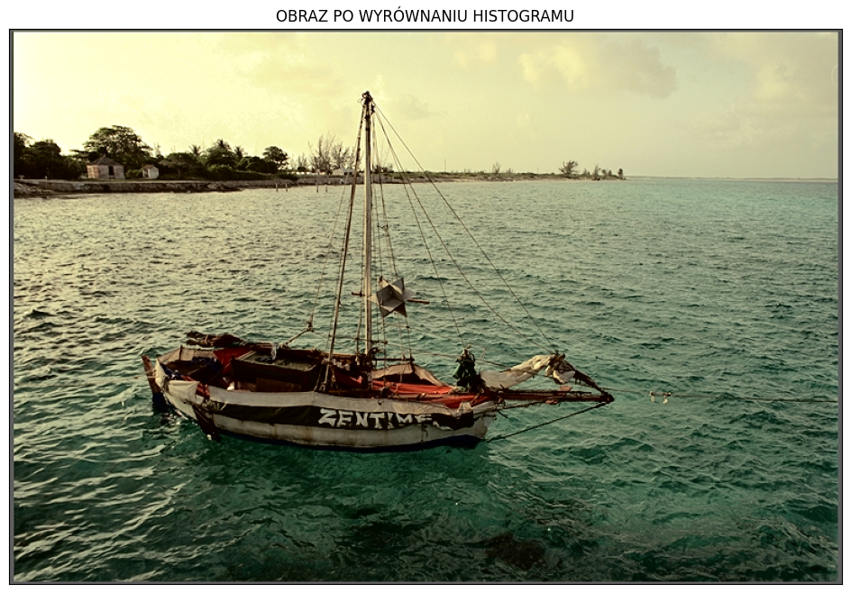

# WMM 25L - Laboratorium 4 - Sprawozdanie

## Podstawowe przetwarzanie obrazów

## Amadeusz Lewandowski

### Numer Obrazu: **331397 % 36 = 5**

### Obraz: boat_col


## Zadanie 1
Zrealizować operację filtracji barwnego obrazu cyfrowego.
Do realizacji zadania wykorzystać obrazy zaszumione (szumem gaussowskim oraz impulsowym).
Każdy z obrazów wejściowych poddać przetwarzaniu filtrem wygładzającym (Gaussa) i filtrem
medianowym. Każdy obraz wynikowy wyświetlić i obliczyć dla niego PSNR (w stosunku do obrazu
oryginalnego, nie zaszumionego!, funkcja do obliczania PSNR dostępna jest w przykładowym
skrypcie). Ocenić działanie filtrów dla masek o rozmiarach: 3x3, 5x5, 7x7.
Zebrać w tabeli PSNR dla różnych rodzajów szumów, filtrów i rozmiarów maski.


### Tabela PSNR

| Obraz / Maska                         |  3x3  |  5x5  |  7x7  | 
|---------------------------------------|-------|-------|-------|
| Szum Impulsowy po Filtrze Gaussa      | 27.08 | 26.04 | 24.93 |
| Szum Gaussowski po Filtrze Gaussa     | 28.48 | 26.59 | 25.17 |
| Szum Impulsowy po Filtrze Medianowym  | 27.67 | 24.48 | 23.67 |
| Szum Gaussowski po Filtrze Medianowym | 27.06 | 24.37 | 23.63 |

**Jaki wpływ na skuteczność filtracji i na zniekształcenie obrazu ma rozmiar maski filtru?**

Większa maska filtru lepiej usuwa szumy z obrazu, jednakże go również zniekształca powodując rozmycie i utratę ostrości, aczkolwiek filtr Gaussa kiepsko radzi sobie z szumem impulsowym.

**Czy ocena subiektywna uzyskanych obrazów wynikowych, jest zgodna z PSNR (lepsza jakość – większy PSNR)?**

Tak jest zgodna (a przynajmniej mocno powiązana), ponieważ obrazy z najmniejszą maską filtru (3x3) mają największe PSNR i są najlepszej jakości (są dużo mniej rozmyte i nieostre w porównaniu z obrazów do większą maską filtru).

## Zadanie 2
Zrealizować operację wyrównania histogramu dla obrazu barwnego i zapisać obraz wynikowy do pliku. UWAGA: operację wyrównania histogramu należy wykonać wyłącznie dla składowej odpowiadającej za jasność, w tym celu należy wejściowy obraz RGB skonwertować do innej przestrzeni (np. YCbCr/YUV), a po wyrównaniu histogramu dla właściwej składowej powrócić do pierwotnego formatu.
Porównać uzyskane obrazy i ich histogramy (w szczególności: histogram dla składowej, dla której wykonano operację wyrównywania histogramu). 





Po operacji wyrównania histogramu dla jasności kolory na obrazie w niektórych miejscach stały się ciemniejsze (w szczególności woda pod łodzią, wyspa w tle czy kadłub samej łodzi). Histogram po wykonaniu operacji przyjmuje trochę większe wartości niż wcześniej i są one bardziej zrównoważone, ponieważ przed operacją na wykresie widać swego rodzaju górę, która potem opada. Po operacji idą mniej więcej w podobnym kierunku.

**Czy obraz po wyrównaniu histogramu jest subiektywnie lepszej jakości?**

Moim zdaniem obraz nie jest ani gorszy ani lepszy, jest po prostu inny. Jedyną rzeczą, która mogłaby przemawiać za tym, że jest gorszy są mało widoczne przedmioty na łodzi ze względu na ich przyciemnienie. Niemniej uważam, że ciemniejsze tony dodają mu jakiejś głębi.

## Zadanie 3
Korzystając z filtru Laplace’a do wyznaczenia wysokoczęstotliwościowych składowych obrazu dokonać wyostrzenia obrazu: img_out = img_in + W*img_laplace.
Uwaga: należy pamiętać, że wyostrzanie obrazu powoduje również uwydatnienie szumu w obrazie, w niektórych przypadkach (niezbyt dobrej jakości obrazów oryginalnych) przydatne może być wstępne wygładzenie obrazu filtrem dolnoprzepustowym (np. filtrem Gaussa).
Wskazówka: wykorzystać funkcję cv2.addWeighted() do sumowania obrazów i równoczesnej konwersji wyniku do 8-bitowych liczb całkowitych z przedziału [0, 255].
Uwaga: ze względu na sposób wyliczania laplasjanu w bibliotece OpenCV w celu uzyskania ‘dobrych’ wyników należy odjąć ‘obraz wysokoczęstotliwościowy’, czyli zastosować ujemne wartości wagi W.


**Jaki jest wpływ wagi składowej wysokoczęstotliwościowej na postać obrazu wynikowego?**

Im wyższa waga składowej wysokoczęstotliwościowej tym krawędzie na obrazie są ostrzejsze i bardziej wyraźne.

**Dla jakich wartości tej wagi uzyskuje się dobre, przyjemne dla oka wyniki?**

Najlepsze wyniki to wyniki z najniższymi wagami tj. 1 i 2, chociaż 5 też jeszcze nie jest najgorsza (ujdzie). Natomiast na obrazach o wagach 8 i 10 te krawędzie są zbyt nienaturalne i wyraziste co sprawa, że nie są przyjemne dla oka. Dla tego obrazu wagi poniżej 5 powinny być w porządku.


## Kod

```Python
import numpy as np
import cv2
import matplotlib.pyplot as plt

from typing import List, Dict

# Constants
INPUT_PATH = "./input_images/"
OUTPUT_PATH = "./output/"

STANDARD_IMG_PATH = INPUT_PATH + "boat_col.png"
INOISE_IMG_PATH = INPUT_PATH + "boat_col_inoise.png"
NOISE_IMG_PATH = INPUT_PATH + "boat_col_noise.png"

MASKS = [3, 5, 7]
WEIGHTS = [1, 2, 5, 8, 10]


def save_image(image: np.array, image_name: str, file_name: str) -> None:
    """
    Saves image to the output directory with the specified name.

    Args:
        image (np.array): Image to be saved.
        image_name (str): Title of the image.
        file_name (str): Name of the file to save the image as.
    """
    plt.figure(figsize=(12, 8))
    plt.title(image_name)
    image = cv2.cvtColor(image, cv2.COLOR_BGR2RGB)  # Convert BGR to RGB
    plt.imshow(image, vmin=0, vmax=255)
    plt.xticks([]), plt.yticks([])
    plt.savefig(OUTPUT_PATH + file_name, bbox_inches="tight", pad_inches=0.1)
    plt.close()


def save_image_histogram(image: np.array, image_name: str, file_name: str) -> None:
    """
    Saves histogram of the image to the output directory with the specified name.

    Args:
        image (np.array): Image to be saved.
        image_name (str): Title of the image.
        file_name (str): Name of the file to save the image as.
    """
    image_histogram = cv2.calcHist([image], [0], None, [256], [0, 256])
    image_histogram.flatten()
    plt.figure(figsize=(12, 8))
    plt.title(image_name)
    plt.plot(image_histogram, color="black")
    plt.xlim([0, 256])
    plt.savefig(OUTPUT_PATH + file_name, bbox_inches="tight", pad_inches=0.1)
    plt.close()


def calculate_psnr(first_image: np.array, second_image: np.array) -> float:
    """
    Calculates PSNR between two images.

    Args:
        first_image (np.array): First image.
        second_image (np.array): Second image.
    Returns:
        float: PSNR value.
    """
    imax = 255.0**2
    mse = (
        (first_image.astype(np.float64) - second_image) ** 2
    ).sum() / first_image.size
    return 10.0 * np.log10(imax / mse)


def gaussian_filter(image: np.array, masks: List[int]) -> Dict[int, np.array]:
    """
    Applies Gaussian filter to the image with specified masks.
    Args:
        image (np.array): Image to be filtered.
        masks (List[int]): List of mask sizes.
    Returns:
        Dict[int, np.array]: Dictionary with mask size as key and filtered image as value.
    """
    results = {}
    for mask in masks:
        result = cv2.GaussianBlur(image, (mask, mask), 0)
        results[mask] = result
    return results


def median_filter(image: np.array, masks: List[int]) -> Dict[int, np.array]:
    """
    Applies median filter to the image with specified masks.
    Args:
        image (np.array): Image to be filtered.
        masks (List[int]): List of mask sizes.
    Returns:
        Dict[int, np.array]: Dictionary with mask size as key and filtered image as value.
    """
    results = {}
    for mask in masks:
        result = cv2.medianBlur(image, mask)
        results[mask] = result
    return results


def laplace_filter(image: np.array, weight: int) -> np.array:
    """
    Applies Laplace filter to the image with specified weight.
    Args:
        image (np.array): Image to be filtered.
        weight (int): Weight of the filter.
    Returns:
        np.array: Filtered image.
    """
    gauss = cv2.GaussianBlur(image, (3, 3), 0)
    laplace = cv2.Laplacian(gauss, cv2.CV_64F)
    image = image.astype(np.float64)
    laplace = cv2.addWeighted(image, 1, laplace, -weight, 0)
    laplace = np.clip(laplace, 0, 255)
    return laplace.astype(np.uint8)


if __name__ == "__main__":
    # Task 1
    print("Zadanie 1")
    # Load images
    inoise_image = cv2.imread(INOISE_IMG_PATH, cv2.IMREAD_UNCHANGED)
    noise_image = cv2.imread(NOISE_IMG_PATH, cv2.IMREAD_UNCHANGED)

    # Filter images
    inoise_gaussian = gaussian_filter(inoise_image, MASKS)
    noise_gaussian = gaussian_filter(noise_image, MASKS)
    inoise_median = median_filter(inoise_image, MASKS)
    noise_median = median_filter(noise_image, MASKS)

    standard_image = cv2.imread(STANDARD_IMG_PATH, cv2.IMREAD_UNCHANGED)

    pnsr_values = {}

    save_image(
        inoise_image,
        "SZUM IMPULSOWY",
        "inoise_image.png",
    )

    save_image(
        noise_image,
        "SZUM GAUSSOWSKI",
        "noise_image.png",
    )

    # Calculate PSNR for each mask and save images
    for i in MASKS:
        # Gaussian filter
        save_image(
            inoise_gaussian[i],
            f"SZUM IMPULSOWY PO FILTRZE GAUSSA - MASKA {i}x{i}",
            f"inoise_gaussian_{i}.png",
        )
        print(f"ZAPISANO - inoise_gaussian_{i}.png")
        inoise_gaussian_pnsr = calculate_psnr(standard_image, inoise_gaussian[i])
        pnsr_values[f"inoise_gaussian_{i}"] = inoise_gaussian_pnsr
        print(
            f"PSNR - SZUM IMPULSOWY PO FILTRZE GAUSSA - MASKA {i}x{i}: ",
            inoise_gaussian_pnsr,
        )

        save_image(
            noise_gaussian[i],
            f"SZUM GAUSSOWSKI PO FILTRZE GAUSSA - MASKA {i}x{i}",
            f"noise_gaussian_{i}.png",
        )
        print(f"ZAPISANO - noise_gaussian_{i}.png")
        noise_gaussian_pnsr = calculate_psnr(standard_image, noise_gaussian[i])
        pnsr_values[f"noise_gaussian_{i}"] = noise_gaussian_pnsr
        print(
            f"PSNR - SZUM GAUSSOWSKI PO FILTRZE GAUSSA - MASKA {i}x{i}: ",
            noise_gaussian_pnsr,
        )

        # Median filter
        save_image(
            inoise_median[i],
            f"SZUM IMPULSOWY PO FILTRZE MEDIANOWYM - MASKA {i}x{i}",
            f"inoise_median_{i}.png",
        )
        print(f"ZAPISANO - inoise_median_{i}.png")
        inoise_median_pnsr = calculate_psnr(standard_image, inoise_median[i])
        pnsr_values[f"inoise_median_{i}"] = inoise_median_pnsr
        print(
            f"PSNR - SZUM IMPULSOWY PO FILTRZE MEDIANOWYM - MASKA {i}x{i}: ",
            inoise_median_pnsr,
        )

        save_image(
            noise_median[i],
            f"SZUM GAUSSOWSKI PO FILTRZE MEDIANOWYM - MASKA {i}x{i}",
            f"noise_median_{i}.png",
        )
        print(f"ZAPISANO - noise_median_{i}.png")
        noise_median_pnsr = calculate_psnr(standard_image, noise_median[i])
        pnsr_values[f"noise_median_{i}"] = noise_median_pnsr
        print(
            f"PSNR - SZUM GAUSSOWSKI PO FILTRZE MEDIANOWYM - MASKA {i}x{i}: ",
            noise_median_pnsr,
        )
    # Save PSNR values to a text file
    with open(OUTPUT_PATH + "pnsr_values.txt", "w") as f:
        for key, value in pnsr_values.items():
            f.write(f"{key}: {round(value, 2)}\n")
    print("ZAPISANO - pnsr_values.txt")

    # Task 2
    print("Zadanie 2")

    standard_image = cv2.imread(STANDARD_IMG_PATH, cv2.IMREAD_UNCHANGED)

    # Convert to YCrCb color space and apply histogram equalization
    standard_image_YCrCb = cv2.cvtColor(standard_image, cv2.COLOR_BGR2YCrCb)
    standard_image_YCrCb[:, :, 0] = cv2.equalizeHist(standard_image_YCrCb[:, :, 0])
    standard_image_YCrCb = cv2.cvtColor(standard_image_YCrCb, cv2.COLOR_YCrCb2BGR)
    save_image(
        standard_image,
        "STANDARDOWY OBRAZ",
        "standard_image.png",
    )
    print("ZAPISANO - standard_image.png")
    save_image(
        standard_image_YCrCb,
        "OBRAZ PO WYRÓWNANIU HISTOGRAMU",
        "standard_image_YCrCb.png",
    )
    print("ZAPISANO - standard_image_YCrCb.png")
    save_image_histogram(
        standard_image,
        "HISTOGRAM OBRAZU PRZED WYRÓWNANIEM",
        "standard_image_histogram.png",
    )
    print("ZAPISANO - standard_image_histogram.png")
    save_image_histogram(
        standard_image_YCrCb,
        "HISTOGRAM OBRAZU PO WYRÓWNANIU",
        "standard_image_YCrCb_histogram.png",
    )
    print("ZAPISANO - standard_image_YCrCb_histogram.png")

    # Task 3
    print("Zadanie 3")

    standard_image = cv2.imread(STANDARD_IMG_PATH, cv2.IMREAD_COLOR)

    # Apply Laplace filter with different weights
    for weight in WEIGHTS:
        laplace_image = laplace_filter(standard_image, weight)
        save_image(
            laplace_image.astype(np.uint8),
            f"OBRAZ PO FILTRACJI LAPLASA - WAGA {weight}",
            f"laplace_{weight}.png",
        )
        print(f"ZAPISANO - laplace_{weight}.png")
```