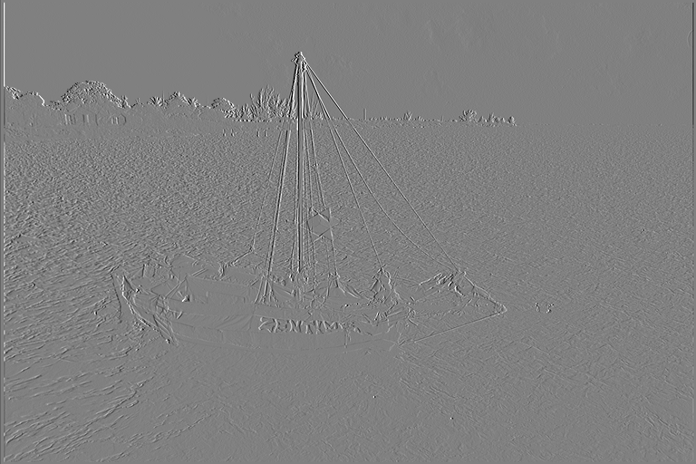
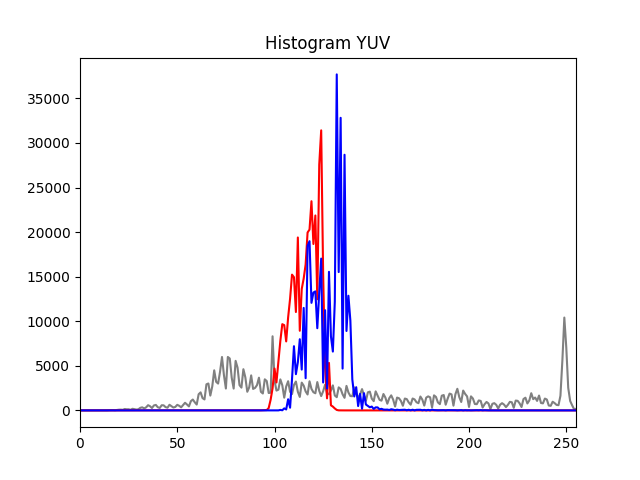

# WMM 25L - Laboratorium 5 - Sprawozdanie

## Statyczne właściwości obrazów

## Amadeusz Lewandowski

### Numer Obrazu: **331397 % 36 = 5**

### Obraz: boat_mono & boat_col


## Zadanie 1 (obraz monochromatyczny)
### 1.1 
Obliczyć entropię obrazu wejściowego.

Entropia obrazu wejściowego: **7.454**

### 1.2 
Wyznaczyć obraz różnicowy w taki sposób, że wartość każdego piksela zastępowana jest różnicą
pomiędzy wartością tego piksela a wartością jego lewego sąsiada (kodowanie różnicowe /.
predykcyjne). Dla pierwszego piksela w linii należy przyjąć wartość sąsiada równą 127 (środkowa
wartość przedziału zmienności wartości pikseli).

Wyświetlić obraz różnicowy.




Wyznaczyć histogram obrazu różnicowego i porównać go z histogramem obrazu oryginalnego.


Jak widać na powyższych wykresach, histogram obrazu oryginalnego jest bardzo rozproszony co mówi o zróżnicowaniu intensywności jego pikseli. Natomiast histogram obrazu różnicowego skupia się na jednej wartości (zero), a opuszczając ją bardzo szybko spada w dół co świadczy o bardzo podobnej intensywności i jasności pikseli na tym obrazie.

Wyznaczyć entropię obrazu różnicowego i porównać ją z entropią obrazu oryginalnego.

Entropia obrazu wejściowego: **7.454**
Entropia obrazu różnicowego: **5.07**

Jak widać entropia obrazu różnicowego jest znacznie mniejsza niż obrazu różnicowego co jest zgodne z histogramami i faktem, że w obrazie różnicowym różnice między sąsiadującymi pikselami są niewielkie, stąd mniejsza entropia.

### 1.3
Wyznaczyć współczynniki DWT korzystając z funkcji zamieszczonej w przykładowym skrypcie.

Wyświetlić poszczególne pasma.  

### LL


### LH


### HL


### HH


Wyznaczyć histogramy i obliczyć entropię dla wszystkich pasm. 


Entropia LL: **7.5088**

Entropia LH: **5.6255**

Entropia HL: **4.3832**

Entropia HH: **4.9000**

Średnia entropia: **5.6044**

Porównać wyniki (histogram, entropia) uzyskane dla poszczególnych pasm między sobą (czy któreś 
się wyróżniają i dlaczego?) oraz z wynikami uzyskanymi dla obrazu oryginalnego i obrazu 
różnicowego. 

Z powyższych wyników wynika, że pasmo LL ma najwyższą entropię zbliżoną do obrazu oryginalnego, czym wyróżnia się na tle pozostałych. Przyczyną takiego stanu rzeczy jest to, że pasmo to zawiera główną informacyjną zawartość obrazu. Pasma skupiające się na detalach obrazu (LH, HL, HH) mają te entropie znacznie niższe zbliżone do entropii obrazu różnicowego.
Ten sam wniosek możemy wysnuć z obserwacji histogramów, gdzie ten pierwszy (pasmo LL) przypomina ten obrazu oryginalnego, z kolei pozostałe trzy różnicowego.

### 1.4

Obliczyć przepływność (liczbę bitów przypadającą na jeden piksel) dla obrazu skompresowanego 
koderem PNG (obraz wejściowy) i porównać ją z obliczonymi uprzednio entropiami obrazu 
oryginalnego, różnicowego i falokowego. Czy przepływność mniejsza od entropii oznacza, że 
zależność: lśr ≥ H jest nieprawdziwa?

Bitrate: **5.1094**

Entropia obrazu oryginalnego: **7.4539**

Entropia obrazu różnicowego: **5.0705**

Entropia LL: **7.5088**

Entropia LH: **5.6255**

Entropia HL: **4.3832**

Entropia HH: **4.9000**

Średnia entropia: **5.6044**

Z powyżyszch wynika, że przepływność obrazu PNG jest niższa niż entropia obrazu oryginalnego czy LL. Jest zbliżona do entropii obrazu różnicowego, trochę mniejsza niż entropia pasma LH i znacznie niższa niż HL i HH. W tym przypadku przepływność mniejsza od entropii nie obala zależności lśr ≥ H. Obliczona na podstawie histogramu entropia nie uwzględnia korelacji 
między pikselami. W praktyce, koder PNG wykorzystuje takowe korelacje, co doprowadza do uzyskania 
efektywnej przepływności niższej od wartości entropii. 


## Zadanie 2 (obraz barwny)
### 2.1

Obliczyć entropię dla składowych RGB barwnego obrazu testowego.

Entropia R: **7.3724** 

Entropia G: **7.3897** 

Entropia B: **7.4607** 

Średnia entropia: **7.4076**

### 2.2

Dokonać konwersji z RGB do YUV i obliczyć entropię dla składowych YUV. Wyświetlić składowe RGB i YUV. 

### R


### G 


### B


### Y 


### U


### V


Entropia Y: **7.4490**

Entropia U: **4.7082**

Entropia V: **4.9133**

Średnia entropia: **5.6901**

Wyznaczyć histogramy dla wszystkich składowych RGB i YUV.




Porównać wyniki uzyskane dla poszczególnych składowych. Czy dla składowych UV entropia jest 
mniejsza? Z czego ta mniejsza wartość może wynikać? 

Składowe RGB mają podobne entropie, co pokazuje dużą zmienność w zakresie tych kolorów. Natomiast w YUV są znaczące różnice. Na kanale Y (luminacja) widzimy wyraźne zróżnicowanie - wysoka entropia porównywalna z RGB, natomiast kanały chrominacji mają znacznie niższe wartości. Wyniki te odzwierciedlają charakter ludzkiego systemu widzenia, gdyż jako ludzie jesteśmy bardziej wrażliwi na zmiany jasności niż barwy, aczkolwiek nie jest to wytłumaczeniem tego zjawiska, gdyż entropia jest miarą obiektywną.

### 2.3

Wyznaczyć zależność zniekształcenia D od przepływności R (liczba bitów przypadającą na jeden piksel obrazu): D = f(R) – tzw. krzywa R-D – dla kodera JPEG.  

Regulacji stopnia kompresji (przepływności R) należy dokonywać ustawiając wartości parametru 
‘quality’ przy zapisie obrazu do pliku. Wartości parametru ‘quality’ należy dobrać tak, aby uzyskać 
‘gładkie’ wykresy.   
Jako miarę zniekształceń należy użyć szczytowy stosunek sygnału do szumu PSNR i błąd 
średniokwadratowy MSE.   
Zobrazować zależności na wykresach (oddzielny wykres dla każdej miary).  

Jakość: 100, bitrate: 7.0085, MSE: 1.8477, PSNR: 45.4646

Jakość: 97, bitrate: 4.5031, MSE: 3.6190, PSNR: 42.5450

Jakość: 95, bitrate: 3.5966, MSE: 5.5704, PSNR: 40.6719

Jakość: 90, bitrate: 2.5190, MSE: 10.9013, PSNR: 37.7560

Jakość: 85, bitrate: 2.0124, MSE: 16.5047, PSNR: 35.9547

Jakość: 75, bitrate: 1.5053, MSE: 27.1911, PSNR: 33.7865

Jakość: 60, bitrate: 1.1517, MSE: 41.2352, PSNR: 31.9781

Jakość: 40, bitrate: 0.8753, MSE: 59.3286, PSNR: 30.3982

Jakość: 25, bitrate: 0.6517, MSE: 84.9078, PSNR: 28.8413

Jakość: 10, bitrate: 0.3503, MSE: 174.1774, PSNR: 25.7209


Powyższe wykresy pokazują, że MSE rośnie wykładniczo przy zmniejszaniu bitrate'u, a PSNR maleje logarytmicznie przy zmniejszaniu. Sprawia to, że przy wysokich wartościach przepływności uzyskamy małe MSE i dużą wartość stosunku sygnału do szumu, przekładając się na obraz o 
praktycznie niezauważalnych przekształceniach oraz bardzo dobrej jakości. 

Dokonać subiektywnej oceny obrazów zrekonstruowanych (według własnej skali ocen, np.: jakość 
doskonała, bardzo dobra, dobra, średnia, kiepska, zła, bardzo zła, itp., lub: zniekształcenia 
niewidoczne, lekko widoczne, widoczne, bardzo widoczne, nie do przyjęcia, itp.) i zamieścić te oceny 
w sprawozdaniu (niekoniecznie dla każdego obrazu wynikowego osobno, raczej ‘zgrupować’ oceny 
dla pewnych zakresów przepływności). 


### Jakość 100


### Jakość 75


### Jakość 40


### Jakość 25


### Jakość 10


Przy jakości równej 100 mamy jakość doskonałą.
Przy jakości równej około 75 jakość też jest dobra, nie widać tu szczególnych zniekształceń.
Przy jakości równej około 40 jakość jest już gorsza, lecz wciąż nie jest tragiczna więc można powiedzieć, że jest średnia.
Dalej przy około 25 jakość zaczyna być słaba, zniekształcenia są już widoczne tak samo rozmycie.
Przy 10 jakość jest już tragiczna, obraz stracił ostrość i pojawiły się na nim kolorowe plany, zatem jakość jest nie do przyjęcia.

### 2.4

Porównać stopnie kompresji uzyskiwane dla kodera JPEG ze stopniem kompresji uzyskanym dla 
kodera PNG (pamiętając, że w pierwszej części laboratorium wykorzystywany był 
monochromatyczny obraz PNG, a kompresja JPEG była wykonywana dla obrazu barwnego; 
ewentualnie obliczyć przepływność bitową dla obrazu barwnego skompresowanego koderem PNG). 

Przepływność Obrazu PNG: **13.607889811197916**
Przepływność obrazu JPG: **7.008504231770833**

Wyniki pokazują, że przepływność dla PNG jest znacznie wyższa od JPEG, dla JPEG o wysokiej jakości (100). Różnica spowodowana jest tym, że PNG wykorzystuje kompresję bezstratną, podczas gdy JPEG już takie straty ma. Kompresja JPEG dla odpowiednich ustawień stanowi dobry kompromis między zużyciem przestrzeni dyskowej a jakością obrazu.

## Kod

```python
import cv2
import numpy as np
import matplotlib.pyplot as plt
import os

# Constants
INPUT_PATH = "./input_images/"
OUTPUT_PATH = "./output/"

COLOR_IMAGE_PATH = INPUT_PATH + "boat_col.png"
MONO_IMAGE_PATH = INPUT_PATH + "boat_mono.png"


def cv_imshow(img, img_title="image") -> None:
    if (img.dtype == np.float32) or (img.dtype == np.float64):
        img_ = img / 255
    elif img.dtype == np.int16:
        img_ = img * 128
    else:
        img_ = img
        cv2.imshow(img_title, img_)
        cv2.waitKey(0)
        cv2.destroyAllWindows()


def printi(img, img_title="image") -> None:
    print(
        f"{img_title}, wymiary: {img.shape}, typ danych: {img.dtype}, wartości: {img.min()} - {img.max()}"
    )


def calc_entropy(hist):
    pdf = hist / hist.sum()
    entropy = -sum([x * np.log2(x) for x in pdf if x != 0])
    return entropy


def dwt(img):
    maskL = np.array(
        [
            0.02674875741080976,
            -0.01686411844287795,
            -0.07822326652898785,
            0.2668641184428723,
            0.6029490182363579,
            0.2668641184428723,
            -0.07822326652898785,
            -0.01686411844287795,
            0.02674875741080976,
        ]
    )
    maskH = np.array(
        [
            0.09127176311424948,
            -0.05754352622849957,
            -0.5912717631142470,
            1.115087052456994,
            -0.5912717631142470,
            -0.05754352622849957,
            0.09127176311424948,
        ]
    )

    bandLL = cv2.sepFilter2D(img, -1, maskL, maskL)[::2, ::2]
    bandLH = cv2.sepFilter2D(img, cv2.CV_16S, maskL, maskH)[::2, ::2]
    bandHL = cv2.sepFilter2D(img, cv2.CV_16S, maskH, maskL)[::2, ::2]
    bandHH = cv2.sepFilter2D(img, cv2.CV_16S, maskH, maskH)[::2, ::2]

    return bandLL, bandLH, bandHL, bandHH


def calc_mse_psnr(img1, img2):
    """Funkcja obliczająca MSE i PSNR dla różnicy podanych obrazów, zakładana wartość pikseli z przedziału [0, 255]."""
    imax = 255.0**2
    """
    W różnicy obrazów istotne są wartości ujemne, dlatego img1 konwertowany jest do typu np.float64 (liczby rzeczywiste) 
    aby nie ograniczać wyniku do przedziału [0, 255].
    """
    mse = ((img1.astype(np.float64) - img2) ** 2).sum() / img1.size
    psnr = 10.0 * np.log10(imax / mse)
    return (mse, psnr)


if __name__ == "__main__":
    print("Zadanie 1")

    # Task 1.1
    mono_img = cv2.imread(MONO_IMAGE_PATH, cv2.IMREAD_UNCHANGED)
    hist_image = cv2.calcHist([mono_img], [0], None, [256], [0, 256])
    hist_image = hist_image.flatten()
    mono_img_entropy = calc_entropy(hist_image)
    print(f"Entropia obrazu mono - {mono_img_entropy:.3f}")

    # Task 1.2
    img_tmp1 = mono_img[:, 1:]
    img_tmp2 = mono_img[:, :-1]
    image_hdiff = cv2.addWeighted(img_tmp1, 1, img_tmp2, -1, 0, dtype=cv2.CV_16S)
    image_hdiff_0 = cv2.addWeighted(mono_img[:, 0], 1, 0, 0, -127, dtype=cv2.CV_16S)
    image_hdiff = np.hstack((image_hdiff_0, image_hdiff))
    image_hdiff_scaled = np.clip(image_hdiff + 128, 0, 255).astype(np.uint8)
    cv_imshow(image_hdiff_scaled, "Obraz Różnicowy")
    cv2.imwrite(OUTPUT_PATH + "mono_diffrence_img.png", image_hdiff_scaled)
    image_tmp = (image_hdiff + 255).astype(np.uint16)
    hist_hdiff = cv2.calcHist([image_tmp], [0], None, [511], [0, 511]).flatten()
    H_image = calc_entropy(hist_image)
    print(f"Entropia obrazu oryginalnego - {H_image:.3f}")
    H_hdiff = calc_entropy(hist_hdiff)
    print(f"Entropia obrazu różnicowego = {H_hdiff:.3f}")
    plt.figure()
    plt.plot(hist_image, color="blue")
    plt.title("Histogram Obrazu Oryginalnego")
    plt.xlim([0, 255])
    plt.savefig(OUTPUT_PATH + "mono_histogram.png")
    plt.figure()
    plt.plot(np.arange(-255, 256, 1), hist_hdiff, color="red")
    plt.title("Histogram Obrazu Różnicowego")
    plt.xlim([-255, 255])
    plt.savefig(OUTPUT_PATH + "mono_histogram_diff.png")

    # Task 1.3
    ll, lh, hl, hh = dwt(mono_img)
    printi(ll, "LL")
    printi(lh, "LH")
    printi(hl, "HL")
    printi(hh, "HH")
    cv_imshow(ll, "LL2")
    cv_imshow(cv2.multiply(lh, 2), "LH2")
    cv_imshow(cv2.multiply(hl, 2), "HL2")
    cv_imshow(cv2.multiply(hh, 2), "HH2")
    cv2.imwrite(OUTPUT_PATH + "LL.png", ll)
    cv2.imwrite(OUTPUT_PATH + "LH.png", cv2.multiply(lh, 2))
    cv2.imwrite(OUTPUT_PATH + "HL.png", cv2.multiply(hl, 2))
    cv2.imwrite(OUTPUT_PATH + "HH.png", cv2.multiply(hh, 2))

    """ Entropia dla obrazów pasmowych """

    hist_ll = cv2.calcHist([ll], [0], None, [256], [0, 256]).flatten()
    hist_lh = cv2.calcHist(
        [(lh + 255).astype(np.uint16)], [0], None, [511], [0, 511]
    ).flatten()
    hist_hl = cv2.calcHist(
        [(hl + 255).astype(np.uint16)], [0], None, [511], [0, 511]
    ).flatten()
    hist_hh = cv2.calcHist(
        [(hh + 255).astype(np.uint16)], [0], None, [511], [0, 511]
    ).flatten()
    H_ll = calc_entropy(hist_ll)
    H_lh = calc_entropy(hist_lh)
    H_hl = calc_entropy(hist_hl)
    H_hh = calc_entropy(hist_hh)
    print(
        f"H(LL) = {H_ll:.4f} \nH(LH) = {H_lh:.4f} \nH(HL) = {H_hl:.4f} \nH(HH) = {H_hh:.4f}\nH_śr = {(H_ll+H_lh+H_hl+H_hh)/4:.4f}"
    )

    """ Wyświetlenie histogramów - jeden obraz z czterema pod-obrazami """
    fig = plt.figure()
    fig.set_figheight(fig.get_figheight() * 2)
    fig.set_figwidth(fig.get_figwidth() * 2)
    plt.subplot(2, 2, 1)
    plt.plot(hist_ll, color="blue")
    plt.title("Histogram LL")
    plt.xlim([0, 255])
    plt.subplot(2, 2, 3)
    plt.plot(np.arange(-255, 256, 1), hist_lh, color="red")
    plt.title("Histogram LH")
    plt.xlim([-255, 255])
    plt.subplot(2, 2, 2)
    plt.plot(np.arange(-255, 256, 1), hist_hl, color="red")
    plt.title("Histogram HL")
    plt.xlim([-255, 255])
    plt.subplot(2, 2, 4)
    plt.plot(np.arange(-255, 256, 1), hist_hh, color="red")
    plt.title("Histogram HH")
    plt.xlim([-255, 255])
    plt.savefig(OUTPUT_PATH + "histograms.png")
    cv2.destroyAllWindows()

    # Task 1.4
    bitrate = (
        8 * os.stat(MONO_IMAGE_PATH).st_size / (mono_img.shape[0] * mono_img.shape[1])
    )
    print(f"bitrate: {bitrate:.4f}")
    print(f"Entropia obrazu oryginalnego: {H_image:.4f}")
    print(f"Entropia obrazu różnicowego: {H_hdiff:.4f}")
    print(f"Entropia obraz falkowego:")
    print(
        f"H(LL) = {H_ll:.4f} \nH(LH) = {H_lh:.4f} \nH(HL) = {H_hl:.4f} \nH(HH) = {H_hh:.4f}\nH_śr = {(H_ll+H_lh+H_hl+H_hh)/4:.4f}"
    )

    print("Zadanie 2")
    # Task 2.1
    color_img = cv2.imread(COLOR_IMAGE_PATH, cv2.IMREAD_UNCHANGED)
    printi(color_img, "image_col")
    image_R = color_img[:, :, 2]
    image_G = color_img[:, :, 1]
    image_B = color_img[:, :, 0]
    hist_R = cv2.calcHist([image_R], [0], None, [256], [0, 256]).flatten()
    hist_G = cv2.calcHist([image_G], [0], None, [256], [0, 256]).flatten()
    hist_B = cv2.calcHist([image_B], [0], None, [256], [0, 256]).flatten()
    H_R = calc_entropy(hist_R)
    H_G = calc_entropy(hist_G)
    H_B = calc_entropy(hist_B)
    print(
        f"H(R) = {H_R:.4f} \nH(G) = {H_G:.4f} \nH(B) = {H_B:.4f} \nH_śr ={(H_R+H_G+H_B)/3:.4f}"
    )
    cv_imshow(image_R, "image_R")
    cv_imshow(image_G, "image_G")
    cv_imshow(image_B, "image_B")
    cv2.imwrite(OUTPUT_PATH + "image_R.png", image_R)
    cv2.imwrite(OUTPUT_PATH + "image_G.png", image_G)
    cv2.imwrite(OUTPUT_PATH + "image_B.png", image_B)
    plt.figure()
    plt.plot(hist_R, color="red")
    plt.plot(hist_G, color="green")
    plt.plot(hist_B, color="blue")
    plt.title("hist RGB")
    plt.xlim([0, 255])
    plt.savefig(OUTPUT_PATH + "hist_RGB.png")
    cv2.destroyAllWindows()

    # Task 2.2
    image_YUV = cv2.cvtColor(color_img, cv2.COLOR_BGR2YUV)
    printi(image_YUV, "image_YUV")
    hist_Y = cv2.calcHist([image_YUV[:, :, 0]], [0], None, [256], [0, 256]).flatten()
    hist_U = cv2.calcHist([image_YUV[:, :, 1]], [0], None, [256], [0, 256]).flatten()
    hist_V = cv2.calcHist([image_YUV[:, :, 2]], [0], None, [256], [0, 256]).flatten()
    H_Y = calc_entropy(hist_Y)
    H_U = calc_entropy(hist_U)
    H_V = calc_entropy(hist_V)
    print(
        f"H(Y) = {H_Y:.4f} \nH(U) = {H_U:.4f} \nH(V) = {H_V:.4f} \nH_śr ={(H_Y+H_U+H_V)/3:.4f}"
    )
    cv_imshow(image_YUV[:, :, 0], "image_Y")
    cv_imshow(image_YUV[:, :, 1], "image_U")
    cv_imshow(image_YUV[:, :, 2], "image_V")
    cv2.imwrite(OUTPUT_PATH + "image_Y.png", image_YUV[:, :, 0])
    cv2.imwrite(OUTPUT_PATH + "image_U.png", image_YUV[:, :, 1])
    cv2.imwrite(OUTPUT_PATH + "image_V.png", image_YUV[:, :, 2])
    plt.figure()
    plt.plot(hist_R, color="red")
    plt.plot(hist_G, color="green")
    plt.plot(hist_B, color="blue")
    plt.title("Histogram RGB")
    plt.xlim([0, 255])
    plt.savefig(OUTPUT_PATH + "rgb_histogram.png")
    plt.figure()
    plt.plot(hist_Y, color="gray")
    plt.plot(hist_U, color="red")
    plt.plot(hist_V, color="blue")
    plt.title("Histogram YUV")
    plt.xlim([0, 255])
    plt.savefig(OUTPUT_PATH + "yuv_histogram.png")
    cv2.destroyAllWindows()

    # Task 2.3
    image = cv2.imread(COLOR_IMAGE_PATH, cv2.IMREAD_UNCHANGED)
    xx = []  ### tablica na wartości osi X -> bitrate
    ym = []  ### tablica na wartości osi Y dla MSE
    yp = []  ### tablica na wartości osi Y dla PSNR

    for quality in [
        100,
        97,
        95,
        90,
        85,
        75,
        60,
        40,
        25,
        10,
    ]:  ### wartości dla parametru 'quality' należałoby dobrać tak, aby uzyskać 'gładkie' wykresy...
        out_file_name = f"out_image_q{quality:03d}.jpg"
        """ Zapis do pliku w formacie .jpg z ustaloną 'jakością' """
        cv2.imwrite(
            OUTPUT_PATH + out_file_name, image, (cv2.IMWRITE_JPEG_QUALITY, quality)
        )
        """ Odczyt skompresowanego obrazu, policzenie bitrate'u i PSNR """
        image_compressed = cv2.imread(OUTPUT_PATH + out_file_name, cv2.IMREAD_UNCHANGED)
        bitrate = (
            8
            * os.stat(OUTPUT_PATH + out_file_name).st_size
            / (image.shape[0] * image.shape[1])
        )
        mse, psnr = calc_mse_psnr(image, image_compressed)
        """ Zapamiętanie wyników do pózniejszego wykorzystania """
        xx.append(bitrate)
        ym.append(mse)
        yp.append(psnr)
        print(
            f"Jakość: {quality}, bitrate: {bitrate:.4f}, MSE: {mse:.4f}, PSNR: {psnr:.4f}"
        )

    fig = plt.figure()
    fig.set_figwidth(fig.get_figwidth() * 2)
    plt.suptitle("Charakterystyki R-D")
    plt.subplot(1, 2, 1)
    plt.plot(xx, ym, "-.")
    plt.title("MSE(R)")
    plt.xlabel("bitrate")
    plt.ylabel("MSE", labelpad=0)
    plt.subplot(1, 2, 2)
    plt.plot(xx, yp, "-o")
    plt.title("PSNR(R)")
    plt.xlabel("bitrate")
    plt.ylabel("PSNR [dB]", labelpad=0)
    plt.savefig(OUTPUT_PATH + "charakterystyki_RD.png")

    cv2.waitKey(0)
    cv2.destroyAllWindows()

    # Task 2.4
    color_png = cv2.imread(COLOR_IMAGE_PATH, cv2.IMREAD_UNCHANGED)
    color_jpg = cv2.imread(OUTPUT_PATH + "out_image_q100.jpg", cv2.IMREAD_UNCHANGED)
    bitrate_png = (
        8
        * os.stat(COLOR_IMAGE_PATH).st_size
        / (color_png.shape[0] * color_png.shape[1])
    )
    bitrate_jpg = (
        8
        * os.stat(OUTPUT_PATH + "out_image_q100.jpg").st_size
        / (color_jpg.shape[0] * color_jpg.shape[1])
    )
    print(f"Przepływność Obrazu PNG: {bitrate_png}")
    print(f"Przepływność obrazu JPG: {bitrate_jpg}")

```
